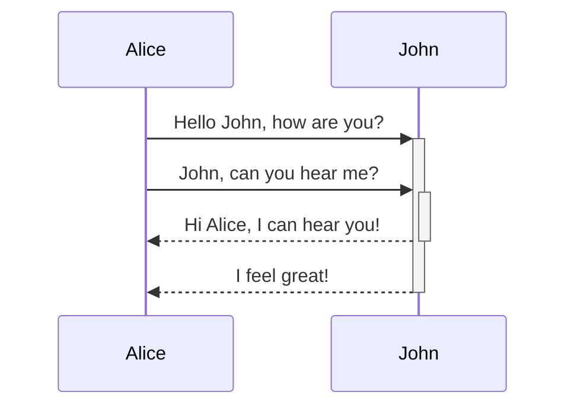
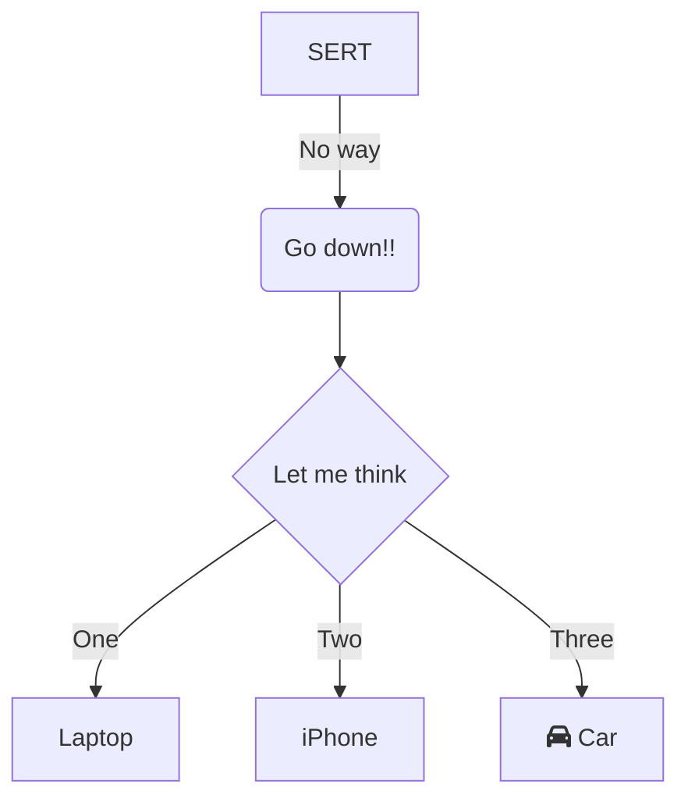

flowchart TD

```mermaid
flowchart TB

    subId[["Eccomi"]] --> roundedId("Non di nuovo!")

    n1[[Terribilis est locus iste]] --> roundedId

  

    n1@{ img: "https://togniser.github.io/Garden/pasted-image-20260524171922.png", h: 200, w: 200, pos: "b"}
    
```

flowchart TD

   
